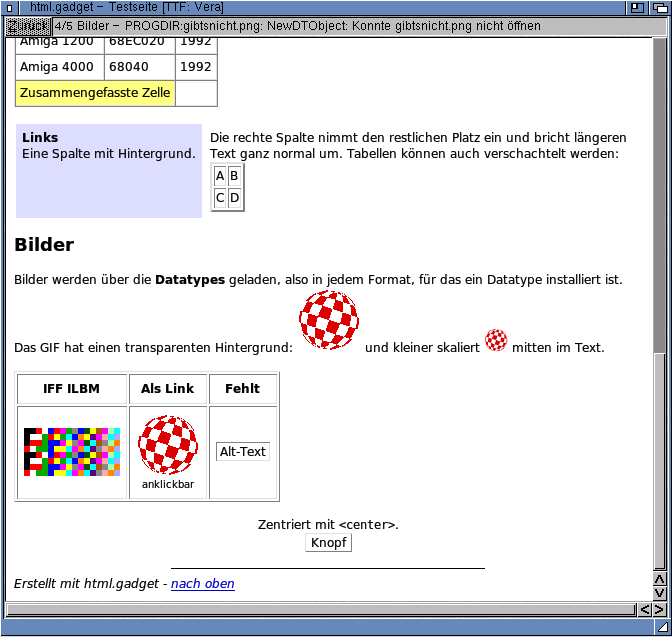
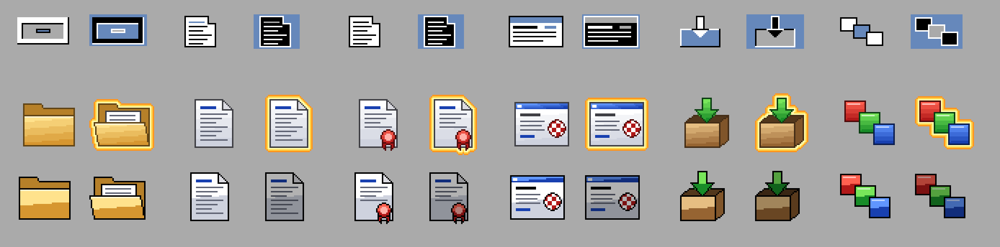

# html.gadget – ReAction-Klasse für einfaches HTML 4 (AmigaOS 3.2)

*[English version](README.md)*

`html.gadget` ist eine öffentliche BOOPSI-Klasse (Superklasse `gadgetclass`),
die als ReAction-Gadget in `layout.gadget` benutzt werden kann und einfache
HTML-4-Dokumente darstellt.



*htmlttf.gadget mit Bitstream Vera unter AmigaOS 3.2 (HTMLDemo TTF)*

## Installation

```
Copy bin/html.gadget SYS:Classes/Gadgets/
Copy bin/htmlttf.gadget SYS:Classes/Gadgets/          ; optional, siehe unten
Copy bin/68020/htmlttf.gadget SYS:Classes/Gadgets/    ; statt dessen ab 68020
```

`htmlttf.gadget` gibt es zusätzlich als Build für 68020 bis 68060 (im Archiv
`Classes/Gadgets/68020/`, `Install` wählt ihn automatisch). Er nutzt die 32-Bit-Multiplikation
und -Division der größeren Prozessoren, verzichtet aber auf die 64-Bit-Varianten, die der
68060 nur emuliert (`-m68020-60 -mtune=68060`). Der Versionsstring endet auf `68020+`.
`html.gadget` verbringt seine Zeit in der graphics.library und gibt es nur für 68000.

Zum Ausprobieren: `bin/HTMLDemo` mit den Beispielseiten und -bildern aus `bin/` in ein
Verzeichnis kopieren und `HTMLDemo` starten (ohne Installation sucht die Demo
die Klasse auch im Programmverzeichnis).

Das Archiv hat klassische Icons mit 4 Farben. In `Icons/` liegen vollständige Sätze im
**GlowIcons**- und **NewIcons**-Stil (beide zeigt die icon.library von OS 3.2 direkt an):
Doppelklick auf `UseGlowIcons`, `UseNewIcons` oder `UseClassic`.
Die Icons erzeugt `tools/mkicons.py`; `make icons` schreibt Beispiele aller Stile nach
`icons/` und eine Vorschau nach `icons/preview.png`.



## Was dargestellt wird

| Bereich | Unterstützt |
|---|---|
| Struktur | `p`, `br`, `div`/`p`/`h1-6 align=…`, `center`, `blockquote`, `address`, `pre`/`xmp`/`listing` (Tabs), `hr` (width, size, align, noshade, color) |
| Überschriften | `h1`–`h6` (größere Fonts, fett) |
| Textstile | `b strong i em cite var dfn u ins s strike del tt code kbd samp big small sub sup q nobr` |
| Fonts | `<font size="1-7/+n/-n" color="…" face="courier…">` |
| Listen | `ul` (disc/circle/square, verschachtelt), `ol` (type 1/a/A/i/I, start, value), `type="none"` an Liste oder Punkt blendet das Zeichen aus (eine Checkbox am Anfang des Punkts tritt an seine Stelle, wie bei Aufgabenlisten), `dl`/`dt`/`dd`, `menu`, `dir` |
| Links | `<a href>` (Farben link/vlink/alink, besuchte Links), Anker `<a name>` und `id="…"` |
| Tabellen | automatisches Spaltenlayout, `colspan`, `rowspan`, `border`, `cellpadding`, `cellspacing`, `width` (px/%), `align`, `valign`, `bgcolor` (table/tr/td), `nowrap`, `caption`, `th`, verschachtelte Tabellen |
| Farben | `<body bgcolor text link vlink alink>`, `#rrggbb`, `#rgb`, 16 HTML-Farbnamen und einige mehr |
| Hintergründe | `bgcolor` bei `body`, `table`, `tr`, `td`, `th`; Hintergrundbilder `<body background>` (über die Seite gekachelt, scrollt mit) sowie `background` bei `table`, `td`, `th` |
| Drucken | `HTMLM_Export` (V1.2) schreibt das Dokument als **PostScript oder PDF** für ein Papierformat: PostScript-Standardschriften (Helvetica/Times, Courier), Text bleibt Text, Bilder mit Originalpixeln und Transparenz, Seitenzahlen, Seitenumbrüche zwischen Zeilen; in eine Datei, nach `PRT:` oder an einen PostScript-Handler |
| Zeichensatz | Latin-1; UTF-8 wird automatisch erkannt und nach Latin-1 gewandelt. Alle HTML-4-Latin-1-Entities, `&#nnn;`, `&#xhh;` und typografische Zeichen (`&euro;` → „EUR", `&hellip;` → „...") |
| Formulare | `input` wird als Platzhalter-Rahmen gezeichnet (nicht bedienbar); Checkboxen und Radio-Buttons zeigen ihren Zustand (`checked`) als Grafik, in htmlttf.gadget geglättet, passend zur Schriftgröße, nur lesend (z. B. Markdown-Aufgabenlisten) |
| Bilder | `img` (und `input type=image`) über **datatypes.library** in jedem installierten Format (GIF, IFF, PNG, JPEG …), an die Screen-Palette angepasst, Transparenz über die Maske, `width`/`height` skalieren das Bild (per `PDTM_SCALE`, sonst mit `BitMapScale()`; fehlt eine Angabe, bleibt das Seitenverhältnis erhalten). Nicht ladbare Bilder erscheinen als Rahmen mit `alt`-Text. Bei `align=left/right` umfließt der Text das Bild (`hspace`, `vspace`, `br clear=left/right/all`) |

Nicht unterstützt: CSS, JavaScript, Bilder aus dem Netz, Frames,
umfließende Tabellen (`align=left/right` positioniert nur), Formular-Bedienung.
`<script>`, `<style>`, `<title>` & Co. werden korrekt übersprungen.

## Benutzung

```c
#include <gadgets/html.h>
#include <proto/html.h>

struct Library *HTMLBase = OpenLibrary("gadgets/html.gadget", 1);

Object *html = NewObject(HTML_GetClass(), NULL,   /* oder NewObject(NULL, "html.gadget", ...) */
    GA_ID,        GID_HTML,
    GA_RelVerify, TRUE,
    HTML_File,    "PROGDIR:hilfe.html",
    TAG_DONE);
```

Wird ein Link angeklickt, meldet das Gadget `WMHI_GADGETUP` (Code = Link-Nummer).
Das Ziel steht dann in `HTML_LinkURL`, das Verzeichnis der zuletzt geladenen Datei
in `HTML_BaseDir`. Links der Form `#anker` scrollt das Gadget selbst.

**Text markieren:** Ziehen mit der linken Maustaste markiert Text (über den Rand hinaus wird
automatisch gescrollt), ein Doppelklick markiert ein Wort. Die Anwendung kopiert die Markierung
mit `HTML_Copy` in die Zwischenablage, typischerweise über den Menüpunkt „Kopieren“ (Amiga-C).
Umbrochene Zeilen eines Absatzes werden dabei wieder zusammengefügt, Tabellenspalten durch
TAB getrennt.

Scroller werden über ICA angebunden (siehe `demo/htmldemo.c`):

```c
struct TagItem html2scroller[] = {
    { HTML_Top, SCROLLER_Top }, { HTML_Total, SCROLLER_Total },
    { HTML_Visible, SCROLLER_Visible }, { TAG_DONE }
};
struct TagItem scroller2html[] = { { SCROLLER_Top, HTML_Top }, { TAG_DONE } };
```

### Stack

Für die stackhungrigen Arbeiten wechselt das Gadget auf einen eigenen Stack von 64 KB: Parsen,
Layout, die FreeType-Ausgabe von htmlttf.gadget und `HTMLM_Export` (Intuition ruft das Gadget
unter Umständen im input.device-Task auf). Anderes läuft auf dem Stack der **aufrufenden
Anwendung**: Beim Setzen von `HTML_File` oder `HTML_Text` lädt das Gadget die Bilder über die
datatypes.library und öffnet Schriften mit der diskfont.library, dazu kommen window.class und
layout.gadget. Die Anwendung sollte **mindestens 16 KB, besser 32 KB** Stack haben; zu wenig
Stack führt typischerweise beim Laden eines Dokuments oder seiner Bilder zum Absturz
(Software-Fehler 80000003/80000004).

Von der Workbench bekommt ein Programm den Stack aus seinem Icon, ein Programm ohne eigenes Icon
nur 4 KB; in der Shell setzt ihn der Befehl `Stack`. Unabhängig davon kann die Anwendung ihren
Stack im Code sicherstellen:

```c
/* libnix (bebbos amiga-gcc, -noixemul), linken mit -Wl,-u,___stkinit:
 * der Startcode wechselt auf einen Stack dieser Größe, wenn der aktuelle kleiner ist */
unsigned long __stack = 32768;
```

SAS/C berücksichtigt ebenso `long __stack = 32768;`; mit jedem Compiler lässt sich der
GUI-Code über `exec.library/StackSwap()` aufrufen, so wie es das Gadget selbst tut. HTMLDemo
nutzt den Weg über libnix.

### Attribute

| Tag | Typ | Anw. | Bedeutung |
|---|---|---|---|
| `HTML_Text` | STRPTR | ISG | HTML-Quelltext (wird kopiert) |
| `HTML_File` | STRPTR | IS | HTML-Datei laden |
| `HTML_Title` | STRPTR | G | Inhalt von `<title>` |
| `HTML_Top` / `HTML_Left` | LONG | ISGNU | Scrollposition in Pixeln |
| `HTML_Total` / `HTML_TotalWidth` | LONG | GN | Dokumentgröße |
| `HTML_Visible` / `HTML_VisibleWidth` | LONG | GN | sichtbarer Bereich |
| `HTML_LinkURL` | STRPTR | G | `href` des zuletzt geklickten Links |
| `HTML_Anchor` | STRPTR | S | zu einem Anker springen |
| `HTML_Font` / `HTML_FixedFont` | struct TextAttr * | I | Grundschrift proportional / fest (Default: Screen-Font / `courier.font` in passender Größe, sonst System-Font) |
| `HTML_SystemColors` | BOOL | ISG | Dokumente ohne eigene Farben in Screen-Farben statt Schwarz auf Weiß |
| `HTML_Margin` | LONG | ISG | Seitenrand (Default 8) |
| `HTML_LineHeight` | LONG | G | Zeilenhöhe, z. B. als Scroll-Schritt |
| `HTML_AutoAnchors` | BOOL | ISG | `#anker`-Links selbst behandeln (Default TRUE) |
| `HTML_Frame` | BOOL | I | vertiefter Rahmen (Default TRUE) |
| `HTML_NumLinks` | LONG | G | Anzahl der Links |
| `HTML_BaseDir` | STRPTR | G | Verzeichnis der zuletzt geladenen Datei |
| `HTML_LoadImages` | BOOL | ISG | Bilder über Datatypes laden (Default TRUE, gilt ab dem nächsten Dokument) |
| `HTML_ImagesTotal` / `HTML_ImagesLoaded` | LONG | G | Anzahl Bilder im Dokument / davon geladen |
| `HTML_ImageError` | STRPTR | G | Grund, warum das erste Bild nicht geladen werden konnte, sonst NULL |
| `HTML_Copy` | BOOL | S | Markierung als IFF FTXT in die Zwischenablage (Unit 0) kopieren |
| `HTML_SelectAll` / `HTML_ClearSelection` | BOOL | S | alles markieren / Markierung aufheben |
| `HTML_HasSelection` | BOOL | G | ist Text markiert? |
| `HTML_SelectedText` | STRPTR | G | markierter Text (Latin-1), gehört dem Gadget |
| `HTMLM_Export` | Methode | | schreibt das Dokument als PostScript oder PDF, Tags `HTMLEX_…` (V1.2) |

## htmlttf.gadget – alternativer Renderer mit FreeType

`htmlttf.gadget` ist eine zweite, eigenständige Klasse mit demselben Parser, Layout und
denselben `HTML_...`-Attributen (siehe `gadgets/htmlttf.h`). Nur die Darstellung ist anders:

* Text über **FreeType 2.3.8** (statisch eingebunden, nur TrueType/Autohinter/Anti-Aliasing),
  mit echten Fett-/Kursiv-Schnitten; fehlende Schnitte werden synthetisch erzeugt.
* Fonts: **Bitstream Vera**, **DejaVu** oder **Noto**, gesucht in `PROGDIR:fonts/`,
  `FONTS:_TrueType/`, `FONTS:TrueType/`, `FONTS:` (oder `HTMLTTF_FontDir`).
  Größen sind frei skalierbar (Stufen 1–7 = 8/10/12/14/18/24/36 zu 12 der Grundgröße).
* Alles wird in einen 32-Bit-ARGB-Puffer gerechnet (in Streifen zu 32 Zeilen, spart Speicher):
  auf RTG-Screens (> 8 Bit) per `WritePixelArray()` (cybergraphics), auf Palettenscreens
  per Pen-Zuordnung und `WriteChunkyPixels()`.
* Bilder werden per Datatypes als ARGB gelesen (`PDTM_READPIXELARRAY`): echter Alphakanal
  bei PNG, transparente Farbe bei GIF, weiches Skalieren (Flächenmittel/bilinear), und
  sie sind unabhängig vom Screen.
* Hintergrundbilder (wie in `html.gadget`) mit echtem Alphakanal.

| Tag | Typ | Anw. | Bedeutung |
|---|---|---|---|
| `HTMLTTF_FontDir` | STRPTR | I | Verzeichnis der `.ttf`-Dateien |
| `HTMLTTF_FontSet` | STRPTR | I | `"Vera"`, `"DejaVu"` oder `"Noto"` (Default: erste gefundene) |
| `HTMLTTF_Size` | LONG | I | Pixelgröße des Fließtexts (Default: aus dem Screen-Font abgeleitet) |
| `HTMLTTF_FontSetName` | STRPTR | G | tatsächlich benutzte Familie, NULL wenn keine gefunden |

Demo: `HTMLDemo TTF` (optional `FONTSET Noto`, `SIZE 14`). Beim Start von der Workbench
liest die Demo dieselben Optionen aus den Tooltypes (`TTF`, `FONTSET=…`, `SIZE=…`, `FILE=…`;
im Icon als abgeschaltete Beispiele in Klammern) und öffnet Projekte, deren Default-Tool
HTMLDemo ist. Die Fonts liegen in `bin/fonts/`
(Vera: Bitstream-Vera-Lizenz, siehe `Vera-COPYRIGHT.TXT`). Noto (SIL Open Font License) ist
wegen der Größe nicht im Repository: `NotoSans-Regular/-Bold/-Italic/-BoldItalic.ttf` und
`NotoSansMono-Regular/-Bold.ttf` von <https://notofonts.github.io/> (oder aus dem Paket
`fonts-noto-core` einer Linux-Distribution) nach `demo/fonts/` kopieren.

Hinweise zur FreeType-Anbindung (`ttf/`): eigene `ftoption`/`ftmodule`-Konfiguration,
C-Bibliotheks-Ersatz (`ftlibc.c`, inkl. `setjmp`/`longjmp`) und ein `ftsystem.c` ohne Datei-I/O –
die Fonts werden im Anwendungskontext eingelesen und per `FT_New_Memory_Face()` geöffnet,
damit FreeType auch im input.device-Kontext (auf einem eigenen 64-KB-Stack) sicher läuft.
FreeType 2.3.8 gibt Festbreitenschriften pauschal `advanceWidthMax` als Breite; das wird mit
`FT_LOAD_IGNORE_GLOBAL_ADVANCE_WIDTH` umgangen (sonst ist Noto Sans Mono extrem gesperrt).

Demo-Seite dazu: `hintergrund.html`.

`make preview` rendert `demo/example.html` auf dem Host mit demselben Renderer nach `preview.ppm`.

## Bauen

Benötigt [bebbos amiga-gcc](https://codeberg.org/bebbo/amiga-gcc) unter `/opt/amiga` (mit NDK 3.2), für `htmlttf.gadget` zusätzlich
die FreeType-2.3.8-Quellen (Aminet `freetype-2.3.8`, Standardpfad `~/AmiLib/freetype-2.3.8`,
änderbar mit `make FT=...`):

```
make            # bin/html.gadget, bin/HTMLDemo, Beispielseiten und -bilder
make check      # Parser + Layout auf dem Host (mit AddressSanitizer), Vergleich mit test/*.expected
make check-update  # gewollte Layoutänderung als neue Referenz übernehmen
make CPU=-m68020
make dist       # Aminet-Paket html_gadget.lha (mit Icons, Installer-Skript, Autodocs)
make icons      # Beispiel-Icons aller Stile in icons/ und icons/preview.png
```

Alle Amiga-Quellen und HTML-Beispiele sind **ISO-8859-1** kodiert; `make` bricht mit
einer Meldung ab (`make charcheck`), falls sich UTF-8 einschleicht.

### Schriftgrößen

Die HTML-Größen 1–7 (Überschriften, `<font size>`, `<big>`/`<small>`) werden relativ zur
Grundschrift berechnet (Faktoren 8/10/12/14/18/24/36 zu 12) und dann auf die nächste
**tatsächlich vorhandene Bitmap-Größe** der Schriftfamilie gerundet (`AvailFonts()`,
geöffnet mit `FPF_DESIGNED`). So wird nie ein hochskalierter Bitmap-Font benutzt.
Für Helvetica 13 ergibt das 9, 11, 13, 15, 18, 24, 24; `h1`–`h6` = 24, 18, 15, 13, 11, 9.
Outline-Fonts (`.otag`) werden in der exakt berechneten Größe verwendet.

### Bilder und Screens

Bilder werden beim Setzen von `HTML_Text`/`HTML_File` im Kontext der Anwendung geladen
und für den Screen des Gadgets geremappt. Wird das Dokument gesetzt, bevor das Fenster
offen ist, wird der Default-Public-Screen angenommen. Landet das Gadget dann auf einem
anderen Screen, erscheinen die Bilder als leere Rahmen, bis das Dokument erneut gesetzt wird.

`sfd/html_lib.sfd` ist die Schnittstellenbeschreibung; `include/proto`, `include/inline`,
`include/clib` und `include/fd` sind daraus mit `sfdc` erzeugt.

## Aufbau

| Datei | Inhalt |
|---|---|
| `src/html_parse.c` | toleranter Tokenizer + Baumaufbau (implizite End-Tags wie in HTML-4-Browsern), Entities, UTF-8 |
| `src/html_layout.c` | Block-/Zeilenlayout, Listen, Tabellen → Liste positionierter Zeichenelemente |
| `src/html_class.c` | BOOPSI-Dispatcher, Fonts (diskfont), Pens (`ObtainBestPen`), Bilder (datatypes), Rendering, Link-Klicks |
| `src/html_select.c` | Textmarkierung: Mausposition → Zeichen, Bereich, Text-Extraktion |
| `src/html_clip.c` | IFF-FTXT in die Zwischenablage (clipboard.device) |
| `src/html_print.c`, `src/html_afm.c` | plattformunabhängige Druck-Engine: Layout mit PostScript-Schriftmaßen, Seitenumbruch, PostScript- und PDF-Ausgabe |
| `src/html_export.c` | `HTMLM_Export` für beide Klassen: Tags, DOS-Ausgabe, Bilder mit Originalpixeln |
| `src/html_lib.c` | Library-Rahmen (RomTag, Init/Open/Close/Expunge, `HTML_GetClass`), für beide Klassen |
| `src/htmlttf_class.c` | BOOPSI-Dispatcher von `htmlttf.gadget` (Fonts laden, Bilder als ARGB, Ausgabe) |
| `src/htmlttf_render.c` | plattformunabhängiger FreeType-Renderer: Glyph-Cache, Compositing, Bildskalierung |
| `ttf/` | FreeType-Konfiguration und -Systemanbindung |

Parser und Layout sind plattformunabhängig und werden per `make check` auf dem Host
getestet (während der Entwicklung zusätzlich mit zufälligem, kaputtem HTML gefuzzt). Gezeichnet wird in eine Offscreen-Bitmap
mit eigenem Layer (flackerfreies Scrollen, sauberes Clipping) und dann geblittet.
Da das Layout rekursiv arbeitet und auch im input.device-Kontext laufen kann, läuft es
per `StackSwap()` auf einem eigenen 64-KB-Stack. Ein Semaphor schützt die Daten
zwischen Anwendungs- und Intuition-Kontext; Dateien und Fonts werden nur im
Anwendungskontext (OM_NEW/OM_SET) geöffnet.

## Lizenz

MIT License, Copyright (c) 2026 André Gewert \<agewert@ubergeek.de\> – siehe `LICENSE`.
`htmlttf.gadget` enthält FreeType 2.3.8: Portions of this software are copyright © 2009
The FreeType Project (www.freetype.org). All rights reserved.
