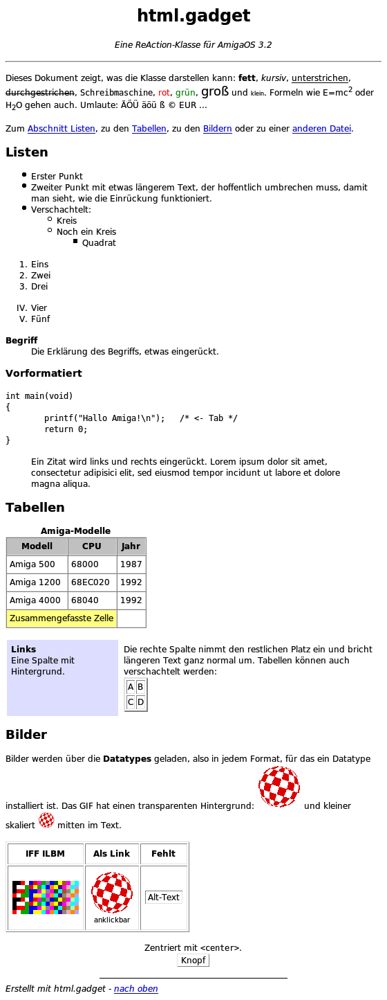

# html.gadget – a ReAction class for simple HTML 4 (AmigaOS 3.2)

*[Deutsche Fassung](README.de.md)*

`html.gadget` and `htmlttf.gadget` are public BOOPSI gadget classes (superclass
`gadgetclass`) for **AmigaOS 3.2**. They can be used as ReAction gadgets inside
`layout.gadget` and display simple HTML 4 documents: online help, readme files,
"about" pages or small offline browsers.

* **html.gadget** draws text with the system's bitmap fonts. Larger HTML font sizes are
  rounded to sizes that really exist as bitmap fonts, so no ugly scaled fonts appear.
  Runs on every AmigaOS 3.2 system, 68000 and up.
* **htmlttf.gadget** is a drop-in alternative with the same attributes. It renders
  anti-aliased TrueType fonts through a built-in FreeType 2.3.8 and composites
  everything in 32 bit (pictures with alpha channel). RTG is recommended.



## Features

| Area | Supported |
|---|---|
| Structure | `p`, `br`, `div`/`p`/`h1-6 align=…`, `center`, `blockquote`, `address`, `pre`/`xmp`/`listing` (tabs), `hr` (width, size, align, noshade, color) |
| Headings | `h1`–`h6` (larger fonts, bold) |
| Text styles | `b strong i em cite var dfn u ins s strike del tt code kbd samp big small sub sup q nobr` |
| Fonts | `<font size="1-7/+n/-n" color="…" face="courier…">` |
| Lists | `ul` (disc/circle/square, nested), `ol` (type 1/a/A/i/I, start, value), `dl`/`dt`/`dd`, `menu`, `dir` |
| Links | `<a href>` (link/vlink/alink colours, visited links), anchors `<a name>` and `id="…"`, `#anchor` links are handled by the gadget |
| Tables | automatic column widths, `colspan`, `border`, `cellpadding`, `cellspacing`, `width` (px/%), `align`, `valign`, `bgcolor`, `nowrap`, `caption`, `th`, nested tables |
| Backgrounds | `bgcolor` on `body`, `table`, `tr`, `td`, `th`; tiled background pictures on `body` (scrolls with the page), `table`, `td`, `th` |
| Pictures | `img` (and `input type=image`) in every format a **datatype** exists for; GIF transparency, PNG alpha (htmlttf.gadget); scaled with `width`/`height`; `alt` text for missing pictures |
| Selection | drag with the mouse (auto-scrolls at the edges), double click selects a word; copy to the clipboard as IFF FTXT |
| Character set | Latin-1; UTF-8 documents are detected and converted. All HTML 4 Latin-1 entities, `&#nnn;`, `&#xhh;` |
| Forms | `input` is drawn as a placeholder box (not usable) |

Not supported: CSS, JavaScript, network access, frames, `rowspan`, text flowing around
tables and pictures (`align=left/right` only positions them), usable forms.

## Installation

Download `html_gadget.lha` (Aminet: `dev/gui/html_gadget.lha`) and run the `Install`
script, or copy the classes manually:

```
Copy Classes/Gadgets/html.gadget SYS:Classes/Gadgets/
Copy Classes/Gadgets/htmlttf.gadget SYS:Classes/Gadgets/
```

The demo runs directly from the archive: `Demo/HTMLDemo`, or `HTMLDemo TTF` for
htmlttf.gadget (options `FONTSET Vera|DejaVu|Noto`, `SIZE n`).

## Usage

```c
#include <gadgets/html.h>
#include <proto/html.h>

struct Library *HTMLBase = OpenLibrary("gadgets/html.gadget", 1);

Object *html = NewObject(HTML_GetClass(), NULL,   /* or NewObject(NULL, "html.gadget", ...) */
    GA_ID,        GID_HTML,
    GA_RelVerify, TRUE,
    HTML_File,    "PROGDIR:help.html",
    TAG_DONE);
```

A link click is reported as `WMHI_GADGETUP` with Code = link index; the target is in
`HTML_LinkURL`, the directory of the loaded file in `HTML_BaseDir`. Scrollers are connected
with ICA (see `demo/htmldemo.c`):

```c
struct TagItem html2scroller[] = {
    { HTML_Top, SCROLLER_Top }, { HTML_Total, SCROLLER_Total },
    { HTML_Visible, SCROLLER_Visible }, { TAG_DONE }
};
struct TagItem scroller2html[] = { { SCROLLER_Top, HTML_Top }, { TAG_DONE } };
```

To copy selected text, call `SetGadgetAttrs(html, win, NULL, HTML_Copy, TRUE, TAG_DONE)`
from a menu item (Amiga-C).

### Attributes

| Tag | Type | Use | Meaning |
|---|---|---|---|
| `HTML_Text` | STRPTR | ISG | HTML source (copied) |
| `HTML_File` | STRPTR | IS | load an HTML file |
| `HTML_Title` | STRPTR | G | contents of `<title>` |
| `HTML_Top` / `HTML_Left` | LONG | ISGNU | scroll position in pixels |
| `HTML_Total` / `HTML_TotalWidth` | LONG | GN | document size |
| `HTML_Visible` / `HTML_VisibleWidth` | LONG | GN | visible area |
| `HTML_LinkURL` | STRPTR | G | `href` of the link clicked last |
| `HTML_Anchor` | STRPTR | S | scroll to an anchor |
| `HTML_Font` / `HTML_FixedFont` | struct TextAttr * | I | proportional / fixed base font (html.gadget) |
| `HTML_SystemColors` | BOOL | ISG | screen colours instead of black on white for plain documents |
| `HTML_Margin` | LONG | ISG | page margin (default 8) |
| `HTML_LineHeight` | LONG | G | line height, e.g. as scroll step |
| `HTML_AutoAnchors` | BOOL | ISG | handle `#anchor` links internally (default TRUE) |
| `HTML_Frame` | BOOL | I | recessed frame (default TRUE) |
| `HTML_NumLinks` | LONG | G | number of links |
| `HTML_BaseDir` | STRPTR | G | directory of the last `HTML_File` |
| `HTML_LoadImages` | BOOL | ISG | load pictures (default TRUE) |
| `HTML_ImagesTotal` / `HTML_ImagesLoaded` | LONG | G | pictures in the document / loaded |
| `HTML_ImageError` | STRPTR | G | why the first picture failed, or NULL |
| `HTML_Copy` | BOOL | S | copy the selection to clipboard unit 0 |
| `HTML_SelectAll` / `HTML_ClearSelection` | BOOL | S | select all / clear the selection |
| `HTML_HasSelection` | BOOL | G | is text selected? |
| `HTML_SelectedText` | STRPTR | G | selected text (Latin-1), owned by the gadget |
| `HTMLTTF_FontDir` | STRPTR | I | directory of the `.ttf` files (htmlttf.gadget) |
| `HTMLTTF_FontSet` | STRPTR | I | `"Vera"`, `"DejaVu"` or `"Noto"` (htmlttf.gadget) |
| `HTMLTTF_Size` | LONG | I | pixel size of body text (htmlttf.gadget) |
| `HTMLTTF_FontSetName` | STRPTR | G | font family in use (htmlttf.gadget) |

The full reference is in the Autodocs: [`doc/html_gadget.doc`](doc/html_gadget.doc) and
[`doc/htmlttf_gadget.doc`](doc/htmlttf_gadget.doc).

## Building

Cross compiled on Linux with [bebbo's amiga-gcc](https://codeberg.org/bebbo/amiga-gcc) in
`/opt/amiga` (with NDK 3.2). htmlttf.gadget additionally needs the FreeType 2.3.8 sources
(Aminet `dev/lib/freetype-2.3.8`, default path `~/AmiLib/freetype-2.3.8`, set with
`make FT=...`).

```
make            # bin/html.gadget, bin/htmlttf.gadget, bin/HTMLDemo, demo pages
make check      # parser + layout tests on the host (AddressSanitizer)
make preview    # renders demo/example.html with the FreeType renderer to preview.ppm
make dist       # Aminet archive dist/html_gadget.lha (icons, Installer script, Autodocs)
make CPU=-m68020
```

All Amiga sources and HTML examples are encoded in **ISO-8859-1** (the Amiga character
set); `make` stops (`make charcheck`) if UTF-8 sneaks in. GitHub shows the umlauts in
those files as replacement characters – the files themselves are correct.

The Bitstream Vera fonts are in `demo/fonts/`. Noto is not part of the repository because
of its size: copy `NotoSans-Regular/-Bold/-Italic/-BoldItalic.ttf` and
`NotoSansMono-Regular/-Bold.ttf` from <https://notofonts.github.io/> to `demo/fonts/`.

## Source layout

| File | Contents |
|---|---|
| `src/html_parse.c` | tolerant tokenizer and tree builder (implied end tags like HTML 4 browsers), entities, UTF-8 |
| `src/html_layout.c` | block and line layout, lists, tables → list of positioned draw items |
| `src/html_select.c` | text selection: mouse position → character, range, text extraction |
| `src/html_class.c` | BOOPSI dispatcher of html.gadget: bitmap fonts, pens, pictures, off-screen rendering |
| `src/htmlttf_class.c` | BOOPSI dispatcher of htmlttf.gadget: fonts, ARGB pictures, output |
| `src/htmlttf_render.c` | platform independent FreeType renderer: glyph cache, compositing, scaling |
| `src/html_clip.c` | clipboard writer (IFF FTXT) |
| `src/html_lib.c` | library frame (RomTag, Init/Open/Close/Expunge, `*_GetClass`) for both classes |
| `ttf/` | FreeType configuration, C library shim and system interface |
| `demo/` | HTMLDemo and example pages |
| `test/` | host test and preview programs |
| `tools/mkdist.py`, `package/` | Aminet packaging |

Parser, layout and the FreeType renderer are platform independent and tested on the host;
the renderer output was verified to be pixel-identical on an emulated 68k (vamos).
Layout and FreeType run on a private 64 KB stack (`StackSwap()`), because intuition may call
the gadget on the input.device task; a semaphore protects the data between application and
intuition context, and files and fonts are only opened in the application's context.

## License

MIT License, Copyright (c) 2026 André Gewert \<agewert@ubergeek.de\> – see [`LICENSE`](LICENSE).

htmlttf.gadget contains FreeType 2.3.8: Portions of this software are copyright © 2009
The FreeType Project (www.freetype.org). All rights reserved.
Bitstream Vera fonts: Copyright (c) 2003 by Bitstream, Inc., see `demo/fonts/Vera-COPYRIGHT.TXT`.
